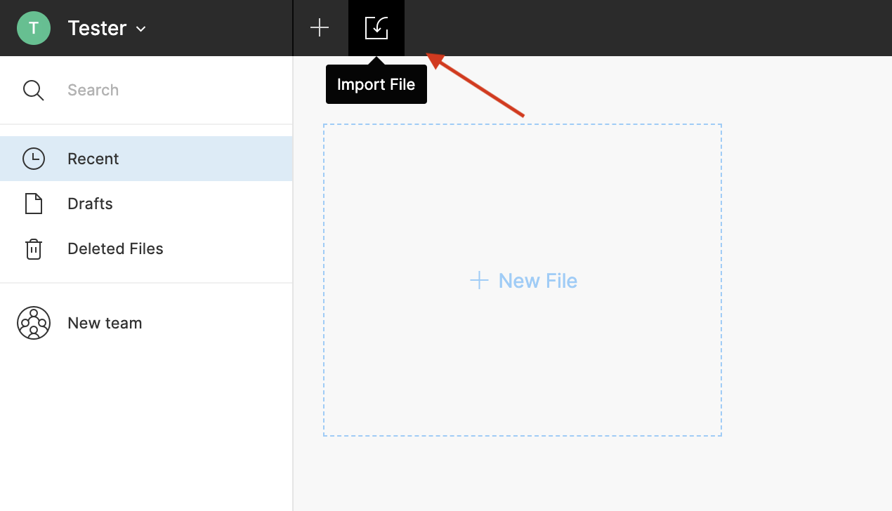
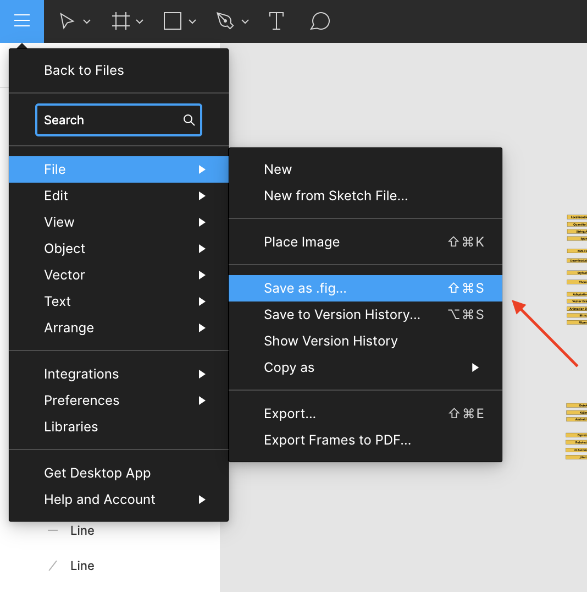

# Contribuye al Roadmap para Android Developer 2020

**Para a versão em portuguese, [clique aqui](./contributing_pt_br.md)**
**For the english version, [click here](./contributing.md)**

## Generando discusiones

Si tienes alguna sugerencia acerca de algo que deba estar en el roadmap y quieres validarlo, te recomendamos que crees un `issue` en nuestro repositorio. De esta manera, podemos lograr discusiones interesantes que seguramente ayudarán a muchas personas acerca de la adopción de este contenidos dentro de sus desarrollos.

## Creando Mejoras

Si tienes alguna idea de mejora directamente sobre lo representado en el roadmap, te recomendamos crear un `pull request` con básicamente dos archivos: la **imagen del roadmap** y el **archivo .fig**, ambos actualizados. Trate de ser bien descriptivo en el PR, así nosotros podemos analizar y discutir mejor lo que estás proponiendo.

### Usando Figma

Nuestro proyecto está implementado usando [Figma](https://www.figma.com/). Figma es una herramienta libre usualmente utilizada para crear prototipos, así, resulta ser la mejor opción para el roadmap, dado que nuestra idea es que cada quien pueda usar la herramienta para mejorar el contenido.

1. Importar el roadmap

    Después de clonar el repositorio, encontrarás dentro de la carpeta `project` el archivo `Android Developer Roadmap 2020.fig`. Con éste, puedes importar el proyecto dentro de tu perfil de Figma para editarlo.

    

2. Acceso y edición del contenido

    Después de subir el archivo, puedes acceder el contenido haciendo doble-clic en `Android Developer Roadmap 2020`. Con clic derecho en él, debes desagrupar el contenido para así acceder a cada componente y editarlo.

    

    Ahora, puedes hacer clic en cada componente padre, cada nodo hijo y demás para cambiar lo que requieras. Ten en cuenta que si cambias algo del componente principal (el nodo con el contenido `Programming Language`) todos los cambios se aplicarán a los demas componentes.

3. Exportar los cambios

    Después de que actualices los contenidos, debes `exportar el archivo .fig`. PUedes hacerlo haciendo clic en `menú de la izquierda > file > Save as .fig...`.

    

    Como parte del pull request, necesitas enviar también la imagen actualizada. Para ello, debes `agrupar el contenido` similar a como cuando lo desagrupaste. Después, la opción `export` se desplegará en el menú de la parte inferior derecha. Haz clic en `+`, pon la info en Sufix, manteniendo el formato `PNG` y haz clic en `Export Group x`. La imagen será descargada.

    

    El patrón que usamos para nombrar el archivo .fig es `Android Developer Roadmap 2020.fig`, y el usado para la imagen es `android_roadmap.png`. Debes usar los mismos.

## Déjanos tu feedback!

Is this file helpful? Did you have any difficulties to do your updates or suggestions? Please let us know! With you help we can not only improve the roadmap but this step by step about how to improve it with us.
Ha sido de ayuda esta guía? Tuviste alguna dificultad haciendo alguna actualización? Tienes alguna sugerencia adicional? Déjanos saberlo por favor! Con tu ayuda no solamente mejoraremos el roadmap sino también este paso a paso.